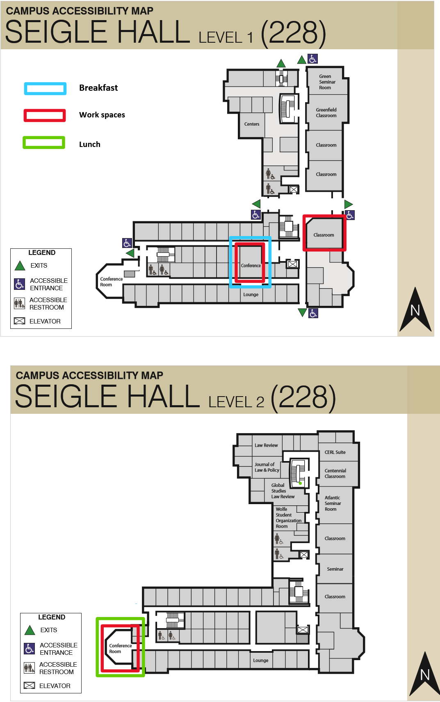

----

## Objectives

The goal of this conference is to enable and nurture conversations which might not otherwise occur about how to leverage new data sources for social science purposes. This year, the topic of the meeting is local government responsiveness.  

### The Mayoral Classification Challenge

The aim of our conference will be to establish which elected mayor does the best job engaging with citizens: this outcome can be measured in a couple of different ways. We will collect  the social media data (both comments and reactions on Twitter and FB) from all mayors in the United States who are included in the Council of Mayors (mayors who are in cities over 30,000 residents).  Separately we will also collect data on mayoral traits: vote share in their elections, the length of their service in office, the type of primary election, their gender, their previous elected experience, their partisanship, their race, their ethnicity, whether they were elected in a partisan election, etc. We will encourage you and your team to exploit the data we have provided, to think deeply about methods and measurement, and to consider seriously what criteria we should use in evaluating mayoral responsiveness.  

----

## Collaborators 

### Visiting 

- [Amber Boydstun](http://www.amber-boydstun.com/), Associate Professor of Political Science, University of California, Davis
- [Marianne Corvellec](https://marianne-corvellec.appspot.com/), Data Scientist, Institute for Globally Distributed Open Research and Education
- [Melody Crowder-Meyer ](http://www.melodycrowdermeyer.org/), Assitant Professor of Political Science, Davidson College
- [Matt Dickenson](http://mattdickenson.com/), Software Engineer
- [Liz Gerber ](http://www-personal.umich.edu/~ergerber/Welcome.html), Professor of Public Policy, University of Michigan
- [Justin Grimmer ](https://www.justingrimmer.org/), Associate Professor of Political Science, University of Chicago
- [Chris Lucas](http://christopherlucas.org/), Assistant Professor of Political Science, Washington University in St. Louis
- [Stella Rouse](http://gvptsites.umd.edu/srouse/), Associate Professor of Government and Politics
- [Alexandra Siegel](https://wp.nyu.edu/smapp/about-2/), PhD candidate, New York University

### WashU

#### Faculty
- [Sanmay Das ](http://www.cse.wustl.edu/~sanmay/), Associate Professor of Computer Science and Engineering
- [Justin Fox](http://pages.wustl.edu/justinfox), Associate Professor of Political Science
- [Hedwig Lee](https://artsci.wustl.edu/faculty-staff/hedwig-lee), Associate Professor of Sociology 
- [Jacob Montgomery](http://pages.wustl.edu/montgomery), Associate Professor of Political Science
- [Betsy Sinclair](https://pages.wustl.edu/betsysinclair), Associate Professor of Political Science
- [Guillermo Rosas](http://pages.wustl.edu/grosas),  Associate Professor of Political Science
- [Andrew Reeves](http://www.andrewreeves.org/), Associate Professor of Political Science
- [Ariela Schachter](http://pages.wustl.edu/schachter), Assistant Professor of Sociology

#### Graduate Students
- [Ryden Butler](https://polisci.wustl.edu/faculty/ryden-butler), Political Science
- [David Carlson](https://sites.wustl.edu/davidcarlson/), Political Science
- [Dominique Lockett](https://polisci.wustl.edu/faculty/dominique-lockett), Political Science
- [JB Duck-Mayr](http://jbduckmayr.com/), Political Science
- [Bryant Moy](https://polisci.wustl.edu/faculty/bryant-moy), Political Science
- [Miguel Pereira](https://miguelmaria.wordpress.com/), Political Science
- [Patrick Rickert](https://polisci.wustl.edu/faculty/patrick-rickert), Political Science
- [Erin Rossiter](https://polisci.wustl.edu/faculty/erin-rossiter), Political Science
- [Min Hee Seo](https://sites.wustl.edu/minheeseo/), Political Science
- [Patrick Silva](https://polisci.wustl.edu/faculty/patrick-cunha-silva), Political Science
- [Hao Yan](http://www.cse.wustl.edu/~haoyan/), Computer Science

----

## Agenda

 

### May 2: Arrival and Happy Hour

After your arrival you are are on your own for dinner, although we have made some suggestions in our Travel Guide. Visitors should keep all receipts for reimbursement.

You are invited to attend a happy hour hosted on the roof of the Moonrise Hotel (weather permitting) from **7:30pm-9:30pm**.  In the event of bad weather, we will meet in the hotel bar on the first floor.

### May 3: The Main Event

The event will begin with a breakfast in the **Weidenbaum Center (#170) at 8:30 AM**. A light breakfast will be provided starting at 8:00 AM.

You are responsible for travel to and from your hotel (it is walkable, but you can also grab an Uber/Lyft). 

[Directions to Seigle Hall](https://www.google.com/maps/dir/Moonrise+Hotel,+6177+Delmar+Blvd,+St.+Louis,+MO+63112/Seigle+Hall,+St.+Louis,+MO/@38.6510304,-90.3099984,16z/data=!3m1!4b1!4m14!4m13!1m5!1m1!1s0x87df4aaa6155fc13:0x1c89cb4a47d03dc9!2m2!1d-90.2987076!2d38.6555695!1m5!1m1!1s0x87d8cab396a2c315:0x370028dc042e3906!2m2!1d-90.3125344!2d38.6487983!3e2)

When you get to Seigle, go to the first floor and turn right. Room 170 is a conference room around the corner.

Map of Seigle Hall:

 

Here's how things will work:

- We will do a short presentation outlining the data and our goals for the day **starting at 8:30AM**.
- Participants will be divided into three groups and the day will be spent tackling the project together.
- A lunch will be available at noon. 
- The collaborative work will continue until 4:30 at which time we will share the results we have developed.  The event will be over by about 5:30 or 6:00.

At 7:00pm we will host a dinner on the rooftop of Moonrise (in the Twilight Room).  Food and beverages will be provided.

### May 4

Participants head home.